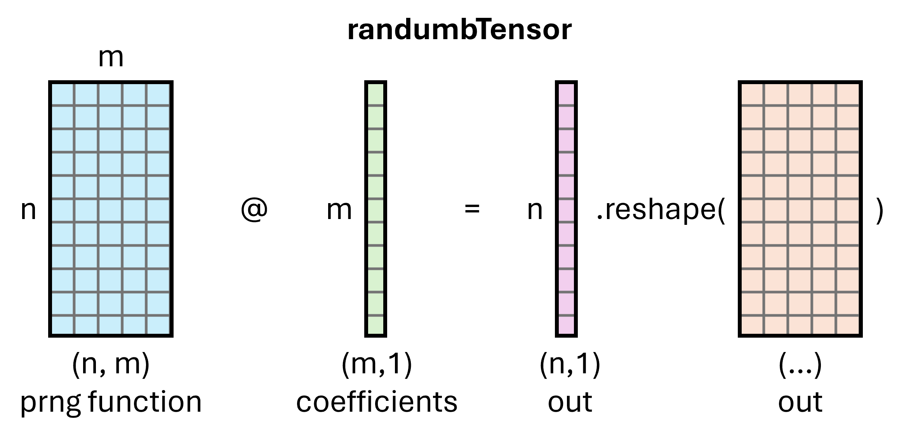

# RANDUMB: Mostly Random Neural Networks

<b>How random can a model be?</b>

This repo is home to an extremely dumb attempt at incorporating random projections into neural network training to create the silliest architecture possible - a *mostly* random one.

While traditional neural network pretraining techniques may optimize every parameter available in the model, what if we kept a subset of those parameters *completely random*? 
The next logical conclusion of course is that if a large subset of the model were to be completely random, we could simply compress that into a seed and generate the values on the fly (beacuse why not?).
The obvious benefits of this approach would be runtime memory efficiency, as the random tensors would only ever require materialization as necessary - you could in theory utilize a rather *ludicrously* large random matrix without ever needing to store any of those numbers in GPU VRAM, especially if fused with further matrix operations.
Not to mention the final model could be represented with a single seed and a much smaller number of the trainable parameters.

While there has been similar work in the past combining random projections and neural networks, most of the implementations utilize custom hardware (i.e. FPGA, Graphcore IPUs), which obviously aren't widely available. 
This repo implements a custom triton Pseudorandom Matrix-Vector Product kernel utilizing the [Squirrel5 PRNG Noise Function](https://twitter.com/SquirrelTweets/status/1421251894274625536) in order to efficiently represent and materialize custom tensors:



It is easy to see how the utilization of a PRNG noise function instead of more traditional sequential PRNGs offers easier parallelization and random access of the noise matrix (particularly for backward pass). 
Most naive SGEMV operations are memory-bound, so one can additionally balance the memory-compute bandwidth requirements of the PMV by adjusting the size of the coefficient dimension.
For further details on the custom kernel implementation, check out the code directly, as well as an attached diagram under `readme_src/materialization_algo.png` to illustrate the algorithm.

When initializing the layers and their coef matrices, we need to manipulate the distribution of the coef matrix to ensure the output materialized matrix has appropriate std. or bounds (otherwise output and grads will explode).
Under the simplifying constraints that *both noise and coef matrices have 0 mean*, the dot product between an independent uniform (a row of noise: x) and random (coef: y) distribution will have variance of:
```math
\begin{aligned}
&\text{var}(x) = \frac{(b−a)^2}{12} = \frac{1}{3} \\
& \text{var}(x \cdot y) = \sum^{d_y}_{i=1}{\text{var}(xy)} = \sum^{d_y}_{i=1}{\text{var}(x)\text{var}(y)} = \frac{d_y}{3}{\text{var}(y)}
\end{aligned}
```
Since the different initialization schemes under `nn.init` have varying requirements of the final output matrix's std., we must manipulate $\text{var}(y)$ such that the output var $\frac{d_y}{3}{\text{var}(y)}=std^2$. 
Hence, $\text{var}(y)=\frac{3}{d_y}std^2$ where $d_y$ is the coef dim.

## Requirements
This repo uses triton==3.2.0 and pytorch>=2.6.0 for `torch.library.triton_op` support. Install with:

`pip3 install --pre torch==2.6.0.dev20250104+cu124 torchvision torchaudio --index-url https://download.pytorch.org/whl/nightly/cu124`

Anything else install as you find import errors pop up :)


## Relevant papers (non-exhaustive)

Pseudorandom matmul based tensor structure inspiration: Shafipour, R. et al. (2024) ‘SeedLM: Compressing LLM Weights into Seeds of Pseudo-Random Generators’. Available at: https://doi.org/10.48550/arXiv.2410.10714

Paper that started it all: Li, C. et al. (2018) ‘Measuring the Intrinsic Dimension of Objective Landscapes’. arXiv. Available at: https://doi.org/10.48550/arXiv.1804.08838.

Tangentially related that showed up on my Twitter feed: Zhong, Z. and Andreas, J. (2024) ‘Algorithmic Capabilities of Random Transformers’. arXiv. Available at: https://doi.org/10.48550/arXiv.2410.04368.

Proof that this stupid idea isn't completely impossible: Aghajanyan, A., Zettlemoyer, L. and Gupta, S. (2020) ‘Intrinsic Dimensionality Explains the Effectiveness of Language Model Fine-Tuning’. arXiv. Available at: http://arxiv.org/abs/2012.13255

OG LoRA paper actually inspired by intrinsic dimensionality: Zeng, Y. and Lee, K. (2024) ‘The Expressive Power of Low-Rank Adaptation’. Available at: https://doi.org/10.48550/arXiv.2310.17513.

Probably useful: Gressmann, F., Eaton-Rosen, Z. and Luschi, C. (2020) ‘Improving Neural Network Training in Low Dimensional Random Bases’. arXiv. Available at: https://doi.org/10.48550/arXiv.2011.04720.

Utilizing orthogonal random features for attention: Choromanski, K. et al. (2022) ‘Rethinking Attention with Performers’. arXiv. Available at: https://doi.org/10.48550/arXiv.2009.14794.


